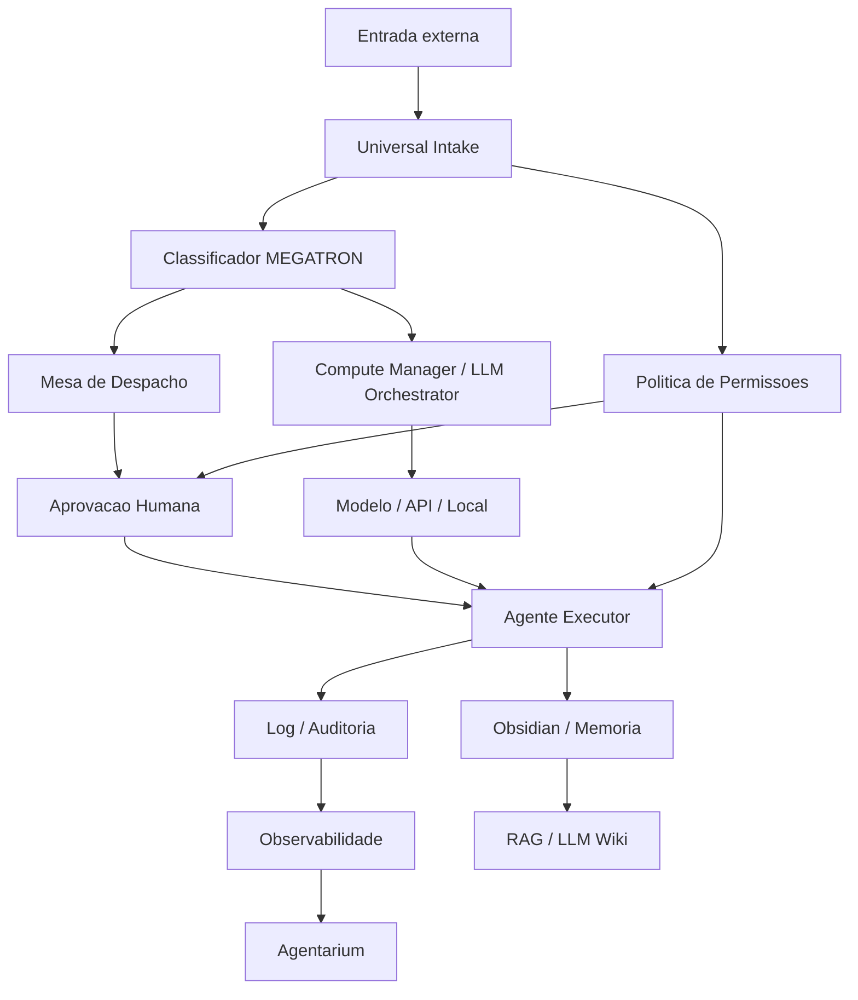

# Gargalos Sistemicos do FabioOS / MEGATRON

## Tese

O principal gargalo do [[10_Dashboard/MEGATRON|MEGATRON]] nao e falta de ferramenta, modelo ou hardware. O gargalo central e fechar o loop operacional:

```text
entrada -> triagem -> decisao -> agente -> aprovacao humana -> execucao -> log -> memoria -> painel
```

Enquanto esse loop nao estiver vivo, [[60_Sistemas/OpenClaw/OpenClaw|OpenClaw]], [[60_Sistemas/n8n/README|n8n]], [[10_Dashboard/RAG_MCP_Control_Plane|RAG/MCP]], [[60_Sistemas/MEGATRON/infra/Compute_Manager_LLM_Orchestrator|LLM Orchestrator]] e [[60_Sistemas/OpenClaw/Agentarium|Agentarium]] parecem pecas soltas.

## No central

[[60_Sistemas/FabioOS/schemas/universal_intake_schema|Universal Intake]] deve ser o ponto unico de entrada de eventos.

Tudo que chegar por [[60_Sistemas/OpenClaw/OpenClaw|OpenClaw]], [[60_Sistemas/n8n/README|n8n]], [[60_Sistemas/FabioOS/scripts/email_intake_dry_run|e-mail]], PDF, comando manual ou mobile precisa virar um item validado, com dono, estado, risco e criterio de aprovacao.

## Mapa de relacoes



## Gargalos cabiveis

| Prioridade | Gargalo | No canonico | Sintoma | Destravamento |
|---|---|---|---|---|
| P0 | Loop operacional fechado | [[80_Specs/MEGATRON/2026-07-02_loop-operacional-fechado-megatron|Loop Operacional Fechado]] | Muitas pecas existem, mas a tarefa real nao atravessa tudo | Teste unico: intake -> aprovacao -> nota -> log -> painel |
| P0 | Mesa de Despacho | [[50_Registros/Relatorios/Bugbot_Mesa_Despacho_Intake_v0.9.0_Cursor|Mesa de Despacho]] | Fabio nao sabe onde aprovar/rejeitar tudo | Agentarium exibir fila viva com estados e botoes |
| P0 | Escrita em memoria | [[60_Sistemas/Agentes/Arquivista_FabioOS|Arquivista]] | Item aprovado nao vira nota util no Obsidian | `aprovado -> nota.md` com link, fonte e log |
| P0 | Estado persistente | [[60_Sistemas/MEGATRON/v1/maestro_state|Maestro State]] | Estados vivem em logs, JSONs e simulacoes dispersas | Um registro de estado consumido por UI, agentes e logs |
| P1 | Observabilidade real | [[60_Sistemas/OpenClaw/Agentarium|Agentarium]] | Agentes parecem animacao, nao trabalho real | Eventos reais vindos do intake, n8n e agentes |
| P1 | Governanca de permissao | [[10_Dashboard/Governanca_FabioOS|Governanca FabioOS]] | Medo correto de auto-envio, vazamento e acoes externas | Matriz de permissao por dominio, dado e agente |
| P1 | Roteamento de modelos | [[60_Sistemas/MEGATRON/infra/Compute_Manager_LLM_Orchestrator|Compute Manager]] | Pergunta recorrente: Claude, GPT, Gemini, local ou API? | Alias por capacidade, custo, privacidade e qualidade |
| P1 | Custos operacionais | [[50_Registros/Decisoes/ADR_2026-07-02_Tokens_vs_Hardware_MEGATRON|Tokens vs Hardware]] | Uso de API sem teto e hardware comprado cedo demais | Telemetria por tarefa, modelo e agente |
| P1 | Canais de borda | [[60_Sistemas/OpenClaw/Plano_Recuperacao_OpenClaw_FabioOS_2026-07-02|OpenClaw como borda]] | QR, token e Companion confundem o fluxo | OpenClaw so entra depois do teste local -> intake |
| P1 | Automacao deterministica | [[60_Sistemas/n8n/README|n8n]] | Workflows existem, mas pouco fecha ponta a ponta | Workflows dry-run que chamam o mesmo contrato universal |
| P1 | Qualidade do Graph View | [[40_Wiki/_MOCs/MOC_Obsidian_FabioOS|MOC Obsidian FabioOS]] | Bolinhas soltas e links que nao levam a decisoes | Hubs, aliases e notas promovidas seletivamente |
| P2 | Memoria versionada | [[10_Dashboard/LLM_Wiki_FabioOS|LLM Wiki FabioOS]] | O sistema aprende, mas nao sabe quando mudou | Decisao, fonte, validade, revisao e superseded |
| P2 | RAG fresco e com fonte | [[10_Dashboard/RAG_MCP_Control_Plane|RAG/MCP Control Plane]] | Consulta sem garantia de atualizacao ou fonte | Reindex controlado, fonte, chunk e politica de exclusao |
| P2 | Continuidade operacional | [[60_Sistemas/MEGATRON/infra/Roadmap_Hardware_Software_MEGATRON|Roadmap Hardware/Software]] | Reinicio quebra servicos e filas | Healthcheck, retomada, backup e fila reexecutavel |
| P2 | Multiagente sem colisao | [[60_Sistemas/FabioOS/Registro_Frentes_Ativas|Registro de Frentes Ativas]] | Claude, Codex e Cursor pisam no mesmo arquivo | Locks, dono, zona e handoff por barramento |
| P2 | Ingestao segura de conhecimento | [[60_Sistemas/Obsidian/Protocolo_Revisao_Links_Nos_Obsidian|Protocolo de Links e Nos]] | Toda fonte vira markdown demais ou bolinha solta | Fonte bruta, resumo, CatalogEntry, nota promovida |
| P2 | Dominio pessoal/profissional | [[60_Sistemas/FabioOS/Protocolo_Ingestao_Memoria_Pessoal_Profissional|Memoria Pessoal e Profissional]] | Mistura e-mail, escola, saude, PRIMUS e financeiro | Classes de dado e rotas separadas |
| P3 | Hardware distribuido | [[60_Sistemas/MEGATRON/infra/Arquitetura_Hardware_MEGATRON_FabioOS_v1|Infra Distribuida]] | Compra vira ansiedade, nao capacidade medida | Node Registry e compra por gargalo observado |

## Dependencias entre gargalos

| Se este no falhar | Entao este outro falha | Motivo |
|---|---|---|
| [[60_Sistemas/FabioOS/schemas/universal_intake_schema|Universal Intake]] | [[50_Registros/Relatorios/Bugbot_Mesa_Despacho_Intake_v0.9.0_Cursor|Mesa de Despacho]] | A UI nao tem contrato seguro para renderizar |
| [[50_Registros/Relatorios/Bugbot_Mesa_Despacho_Intake_v0.9.0_Cursor|Mesa de Despacho]] | [[60_Sistemas/Agentes/Arquivista_FabioOS|Arquivista]] | Nada e aprovado para escrita |
| [[60_Sistemas/Agentes/Arquivista_FabioOS|Arquivista]] | [[10_Dashboard/LLM_Wiki_FabioOS|LLM Wiki]] | A memoria nao recebe conhecimento validado |
| [[10_Dashboard/Governanca_FabioOS|Governanca]] | [[60_Sistemas/OpenClaw/OpenClaw|OpenClaw]] | Canal externo sem permissao vira risco |
| [[60_Sistemas/MEGATRON/infra/Compute_Manager_LLM_Orchestrator|Compute Manager]] | [[50_Registros/Decisoes/ADR_2026-07-02_Tokens_vs_Hardware_MEGATRON|Custos]] | Ninguem sabe quando usar API premium ou local |
| [[60_Sistemas/FabioOS/Registro_Frentes_Ativas|Registro de Frentes]] | [[50_Registros/Barramento_Multiagente|Barramento Multiagente]] | Handoff sem dono gera colisao |
| [[40_Wiki/_MOCs/MOC_Obsidian_FabioOS|MOCs]] | [[10_Dashboard/RAG_MCP_Control_Plane|RAG/MCP]] | RAG ingere um vault desorganizado se o grafo nao tiver hubs |

## Alias canonicos

Use estes aliases para nao criar nos duplicados:

| Mencao no texto | Link canonico |
|---|---|
| MEGATRON, Megatron, orquestrador | [[10_Dashboard/MEGATRON|MEGATRON]] |
| FabioOS, Fabio OS | [[10_Dashboard/FabioOS|FabioOS]] |
| LLM Wiki, wiki operacional | [[10_Dashboard/LLM_Wiki_FabioOS|LLM Wiki FabioOS]] |
| RAG, busca semantica, memoria consultavel | [[10_Dashboard/RAG_MCP_Control_Plane|RAG/MCP Control Plane]] |
| OpenClaw, Companion, gateway visual | [[60_Sistemas/OpenClaw/OpenClaw|OpenClaw]] |
| Agentarium, painel dos agentes | [[60_Sistemas/OpenClaw/Agentarium|Agentarium]] |
| n8n, workflow, automacao | [[60_Sistemas/n8n/README|n8n]] |
| Mesa, despacho, aprovacao | [[50_Registros/Relatorios/Bugbot_Mesa_Despacho_Intake_v0.9.0_Cursor|Mesa de Despacho]] |
| Computacao, roteador de modelos, LLM Router | [[60_Sistemas/MEGATRON/infra/Compute_Manager_LLM_Orchestrator|Compute Manager]] |
| Locks, zonas, frentes | [[60_Sistemas/FabioOS/Registro_Frentes_Ativas|Registro de Frentes Ativas]] |

## Proxima acao

Implementar e provar a [[80_Specs/MEGATRON/2026-07-02_loop-operacional-fechado-megatron|SPEC do Loop Operacional Fechado]].

O teste que importa:

```text
comando manual -> Universal Intake -> Mesa de Despacho -> Aprovar -> Arquivista -> nota Obsidian -> log -> Agentarium
```

## Relacoes

- [[10_Dashboard/MEGATRON]]
- [[10_Dashboard/LLM_Wiki_FabioOS]]
- [[10_Dashboard/RAG_MCP_Control_Plane]]
- [[10_Dashboard/Governanca_FabioOS]]
- [[40_Wiki/_MOCs/MOC_Obsidian_FabioOS]]
- [[60_Sistemas/Obsidian/Protocolo_Revisao_Links_Nos_Obsidian]]
- [[80_Specs/MEGATRON/2026-07-02_loop-operacional-fechado-megatron]]
